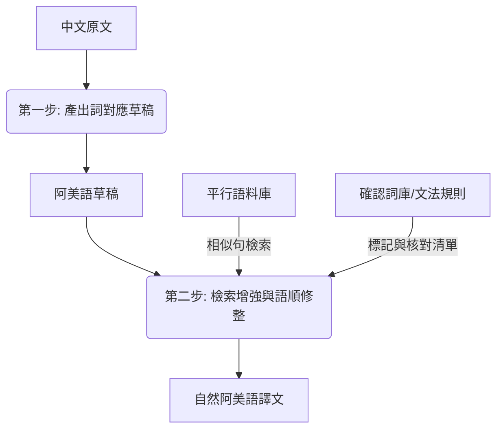

# 兩步翻譯流程指引 (Two-Step Translation Flow Guide)

本文件說明如何利用**檢索增強翻譯 (Retrieval-Augmented Translation, RAT)** 與**文法核對機制**，將草稿優化為自然流暢的阿美語。

---

## 流程圖解



---

## 步驟說明

### 第一步：產出草稿 (Drafting)
* **目的**：利用詞典與詞對應建立包含核心語意與專有名詞的基礎草稿。
* **方法**：沿用既有 ILRDF/萌典草稿機制。此步驟不對語順做過多修整，以確保單詞對應的準確性。

### 第二步：檢索增強與語順修整 (Refining)
在修語順階段，系統將以下列資源輔助譯者或大型語言模型 (LLM)：

1. **相似平行句檢索 (Retrieval-Augmentation)**
   * **指令**：`node glossary/search-corpus.mjs "<中文語句>"`
   * **作用**：提供最貼近中文語意的真實阿美語句子（海岸優先）作為語順和語義結構的參考範本。

2. **確認詞庫套用 (Apply Glossary)**
   * **指令**：`node glossary/apply-glossary.mjs "<草稿文字>"`
   * **作用**：
     * **錯詞與避用詞標記**：如偵測到 `langdaway` 會提示為避用並建議改用 `makofakof`。
     * **已確認詞替換**：自動將待統一辭彙替換為官方或老師認可的標準形式（如 `seyfo`）。

3. **文法規則核對 (Grammar Checklist)**
   * **指令**：透過 `apply-glossary` 腳本自動產出。
   * **作用**：
     * **語序檢查**：分析句首是否為謂語（VSO），提示譯者注意語序自然度。
     * **格位標記核對**：偵測句中的 `ko`、`to`、`no`，提示確認其主格、斜格、屬格用法是否正確。
     * **數字阿拉伯化**：找出拼音數字，提醒將其阿拉伯數字化（例如將 `polo’` 改為 `10`）。

4. **查無標中文 (Chinese Placeholder Fallback)** — 核心原則
   * **時機**：字典（萌典正/反查）與平行語料**皆查無可靠對應**，或 AI 草稿明顯用錯詞（如 `liyon`=旋轉用於「聯盟」、`ʼofad`=白髮用於「貨櫃」）時。
   * **做法**：**不擅自音譯或湊詞**（避免再產生 `Ciwi`／`liyon` 這類無意義殘渣），改以 **`【中文】`** 標出該詞；若語料有候選，寫 **`【中文→候選?】`**，由老師確認或填譯。
     * 例：`【聯盟→misaʼopo?】`、`【樟宜】`、`【坦米爾語 Tamil】`
   * **理由**：把老師的工作從「在正常阿美語中找出隱藏的錯」（慢）變成「看到中文標記直接填譯」（快）。符合專案規則「阿美語不混入中文字，除非括號補充說明」。
   * **底線**：中文標記僅為**過渡**；**發布前必經老師填譯,不得殘留任何 `【】` 中文標記**。

---

## 新加坡條目實證示範

您可以執行下列示範腳本，觀察整個流程在新加坡條目前言段落的實際套用效果：

```bash
node glossary/translate-demo.mjs
```
